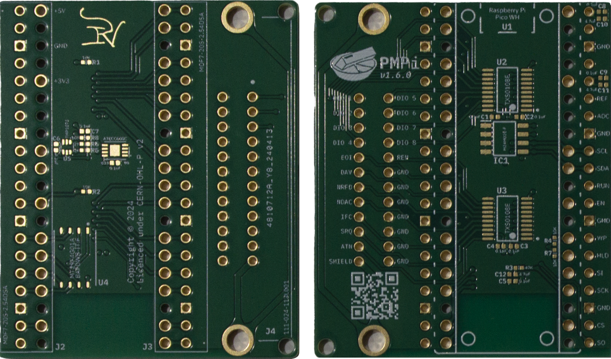
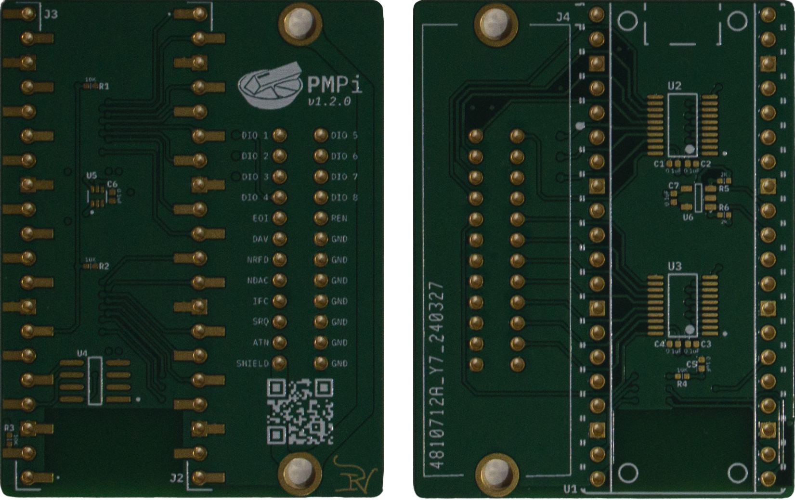

<!-- PROJECT: PMPi -->
<!-- TITLE: PMPi-PCB -->
<!-- FONT: IBM Plex -->
<!-- KEYWORDS: Controller, Raspberry Pi Pico W, Embedded, PCB, Hardware -->
<!-- TECHNOLOGY: Altium -->
<!-- STATUS: Work In Progress -->

[About](#about) - [Usage](#usage) - [Related](#related) - [PCB Gallery](#pcb-gallery) - [License](#license)

## Status

**`Work In progress`**
> *Prototype boards have been received and are yet to be assembled - May 2024*

## About
<!-- DESCRIPTION START -->
This is the PCB repository for the PMPi Project, a wireless PM2813 GPIB Controller using a Raspberry Pi Pico W.

Please refer to the [parent repository](https://github.com/LeHuman/PMPi)
<!-- DESCRIPTION END -->

## Usage

This project is made in Altium, but will be converted, where possible, to a KiCad project once this project is finalized. Otherwise, look at the release page for gerber files which can be directly sent to a PCB manufacturer.

### Requirements

- [Altium](https://www.altium.com/) >= 24.0.0

## Related

- uru-card/[uru-card-pcb](https://github.com/uru-card/uru-card-pcb)
- recursivenomad/[ki-lime-pi-pico](https://github.com/recursivenomad/ki-lime-pi-pico)

## PCB Gallery

### v1.6.0

 \
*Version 1.6.0 of the PMPi PCB*

### v1.2.0

 \
*Version 1.2.0 of the PMPi PCB*

## License

CERN Open Hardware Licence Version 2
